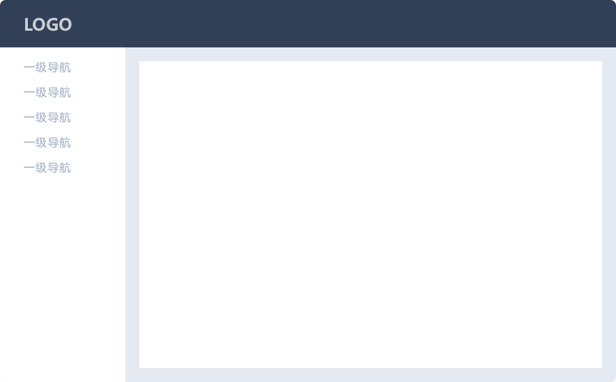
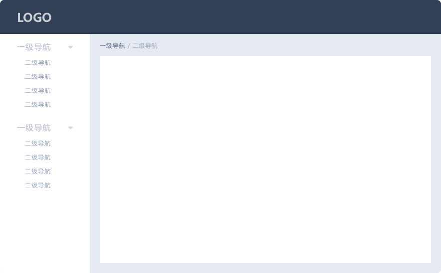

# 导航

导航可以解决用户在访问页面时：在哪里，去哪里，怎样去的问题。 一般导航会有「侧栏导航」和「顶部导航」2 种类型。

## 选择合适的导航

选择合适的导航可以让用户在产品的使用过程中非常流畅，相反若是不合适就会引起用户操作不适（方向不明确）。 以下是「侧栏导航」和 「顶部导航」的区别。

## 侧栏导航

Affix the navigation at the left edge, thus improves its visibility, making it easier to switch between pages. 顶部可放置常用工具，如搜索条、帮助按钮、通知按钮等。 适用于中后台的管理型、工具型网站。

### 一级类目

适用于结构简单的网站：只有一级页面时。 不需要使用面包屑。

### 二级类目

侧栏中最多可显示两级导航； 侧栏中最多可显示两级导航； 当使用二级导航时，我们建议搭配使用面包屑，方便用户定位自己的位置和快速返回。

### 三级类目

适用于较复杂的工具型后台。 适用于较复杂的工具型后台，左侧栏为一级导航，中间栏可显示其对应的二级导航，也可放置其他的工具型选项。

## 顶部导航

顺应了从上至下的正常浏览顺序，方便浏览信息； 顶部宽度限制了导航的数量和文本长度。

适用于导航较少，页面篇幅较长的网站。

